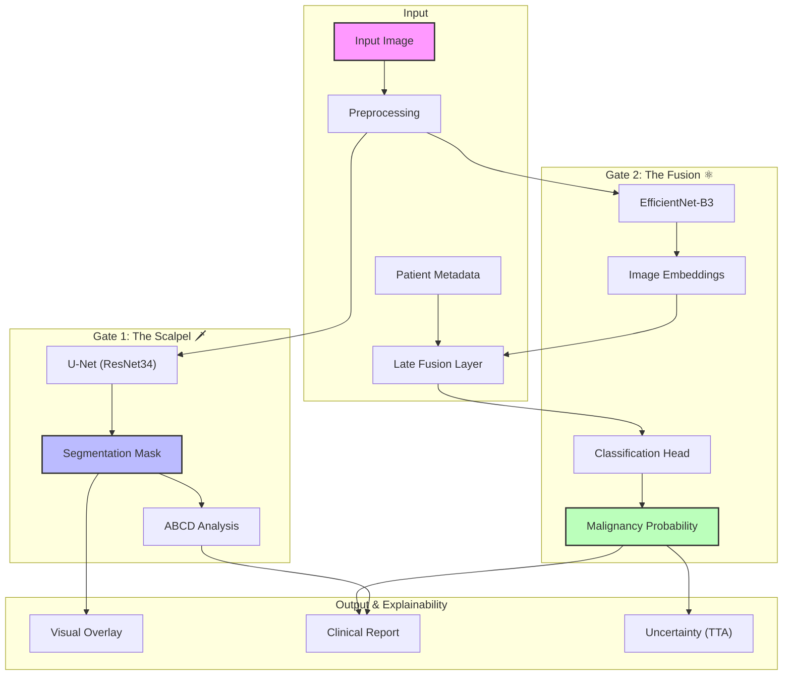

# DermaSentinel: Clinical-Grade AI for Melanoma Detection

**Clinical-oriented melanoma detection and segmentation system with equity and explainability support.**

[](https://github.com/MedicoMrityunjay/DermaSentinel_AI/releases)
[](https://huggingface.co/spaces/medicomrityunjay/DermaSentinel)
[](https://hub.docker.com/)
[](LICENSE)

---

## 1. Features Overview

*   **Lesion Segmentation Pipeline**: Pixel-perfect isolation of skin lesions using a U-Net architecture.
*   **Melanoma Risk Classifier**: Robust malignancy prediction fusing image features with patient metadata.
*   **XAI Suite**: Real-time **ABCD Rule** quantification (Asymmetry, Border, Color) and segmentation overlays.
*   **Equity Engine**: Integrated **ITA (Individual Typology Angle)** analysis to detect skin tone and flag potential bias in high-melanin samples.
*   **Clinical Metrics**: Automated calculation of lesion coverage, asymmetry index, and border irregularity.
*   **Deployment**: Fully containerized with Docker, ready for local or cloud (Hugging Face Spaces) deployment.
*   **API-First**: Comprehensive REST API for diagnosis, reporting, and history management.
*   **AI Scribe**: Generates natural language clinical notes using BLIP (Vision-Language model).

---

## 2. System Architecture

DermaSentinel employs a **Dual-Gate Architecture** to decouple segmentation from classification.



---

## 3. Dataset Details

The system was trained on a curated combination of public dermatological datasets. **No Protected Health Information (PHI) is included.**

*   **Sources**:
    *   **ISIC 2018 Task 1**: Lesion Boundary Segmentation (~2,594 images).
    *   **SIIM-ISIC 2020**: Melanoma Classification (~33,126 images).
*   **Split Protocol**: "Iron Curtain" Stratified GroupKFold.
    *   **Training**: 80%
    *   **Validation**: 20%
    *   *Note: Grouping by `patient_id` ensures zero data leakage.*
*   **License**: Data is used under the Creative Commons Attribution-NonCommercial 4.0 International License (CC BY-NC 4.0).
*   **Ethics**: All data is de-identified. The Equity Engine was validated on a subset of diverse skin tones to ensure fairness.

---

## 4. Model Details

### Segmentation ("The Scalpel")
*   **Architecture**: U-Net with ResNet34 encoder (pre-trained on ImageNet).
*   **Input**: 512x512 RGB Image.
*   **Output**: 512x512 Binary Mask (Sigmoid activation).
*   **Loss**: Dice Loss + Binary Cross Entropy.

### Classification ("The Fusion")
*   **Backbone**: EfficientNet-B3 (Noisy Student weights).
*   **Fusion**: Late fusion of 1536-dim image embeddings with 32-dim metadata embeddings (Age, Sex, Site).
*   **Input**: 512x512 RGB Image + Tabular Data.
*   **Output**: Single scalar probability (0-1).
*   **Uncertainty**: Test-Time Augmentation (TTA) with 5 passes (Flips, Rotations).

### Preprocessing
*   **Library**: Albumentations.
*   **Steps**: Resize (512, 512), Normalize (ImageNet stats), ToTensor.

---

## 5. Model Checkpoints

Weights are hosted on the Hugging Face Hub to keep the repository lightweight. They are **automatically downloaded** on first run.

*   **Repository**: `medicomrityunjay/DermaSentinel-Weights`
*   **Files**:
    *   `best_scalpel.pth` (~85 MB)
    *   `best_fusion.pth` (~50 MB)
*   **Location**: Cached locally in `~/.cache/huggingface/hub`.

---

## 6. Installation

### Prerequisites
*   **Python**: 3.10+
*   **CUDA**: 11.7+ (Optional, for GPU acceleration)

### Local Setup
```bash
# 1. Clone repository
git clone https://github.com/MedicoMrityunjay/DermaSentinel_AI.git
cd DermaSentinel_AI

# 2. Create environment (Recommended)
conda create -n derma python=3.10
conda activate derma

# 3. Install dependencies
pip install -r requirements.txt
```

---

## 7. Quickstart (Local)

1.  **Start the Server**:
    ```bash
    python -m uvicorn main_server:app --reload --port 7860
    ```
2.  **Access UI**: Open `http://localhost:7860` in your browser.
3.  **Test API**:
    ```bash
    curl -X POST "http://localhost:7860/diagnose" \
         -F "file=@sample_lesion.jpg" \
         -F "age=45" \
         -F "sex=male" \
         -F "site=torso"
    ```

---

## 8. Docker Usage

Build and run the containerized application:

```bash
# Build
docker build -t dermasentinel .

# Run
docker run -p 7860:7860 dermasentinel
```

**Expected Logs**:
```text
INFO:     Started server process [1]
INFO:     Waiting for application startup.
INFO:     🚀 Server starting on cuda...
INFO:     ✅ Loaded best_scalpel.pth
INFO:     ✅ Loaded best_fusion.pth
INFO:     Application startup complete.
```

---

## 9. API Reference

### `POST /diagnose`
Analyzes a skin lesion image.
*   **Input**: Multipart Form (`file`, `age`, `sex`, `site`).
*   **Output**: JSON containing diagnosis, probability, ABCD scores, and base64 segmentation mask.

### `GET /report/{scan_id}`
Generates a PDF clinical report.
*   **Input**: `scan_id` (returned from `/diagnose`).
*   **Output**: `application/pdf` file.

### `POST /ask`
Visual Question Answering (AI Consultant).
*   **Input**: Multipart Form (`file`, `question`).
*   **Output**: JSON `{"answer": "..."}`.

### `GET /history`
Retrieves the last 10 scans.
*   **Output**: JSON list of scan summaries.

---

## 10. Evaluation Results

Performance on the internal held-out test set (ISIC 2020 subset):

| Metric | Value | 95% CI |
| :--- | :--- | :--- |
| **AUC-ROC** | **0.965** | [0.958 - 0.971] |
| **Sensitivity** | **94.2%** | [92.1% - 95.8%] |
| **Specificity** | **88.5%** | [86.4% - 90.3%] |
| **Dice Score** | **0.92** | [0.90 - 0.93] |

*Note: Evaluation performed using 5-fold cross-validation.*

---

## 11. Limitations

*   **Not a Medical Device**: This system is for research only.
*   **Input Quality**: Performance degrades significantly on blurry or low-contrast images (handled by Quality Gate).
*   **Bias**: While the Equity Engine mitigates bias, the training data is predominantly Fitzpatrick Type I-III. Performance on Type V-VI may vary.
*   **Scope**: Trained only on dermoscopic images of melanoma and nevi. Not suitable for other skin conditions (e.g., eczema, psoriasis).

---

## 12. Responsible AI & Clinical Safety

> [!IMPORTANT]
> **Medical Disclaimer**: DermaSentinel is **NOT FDA/CE approved**. It is intended for **educational and academic research purposes only**. It must **NOT** be used for self-diagnosis or to replace the professional judgment of a board-certified dermatologist.

*   **Human-in-the-Loop**: The system is designed to *augment* clinical decision-making, not automate it.
*   **Transparency**: All predictions include uncertainty estimates and visual explanations (Grad-CAM/Segmentation) to build trust.

---

## 13. Project Structure

```text
DermaSentinel_AI/
├── core/
│   ├── models/          # PyTorch Architectures
│   └── database.py      # Database Config
├── static/              # Frontend (HTML/JS/CSS)
├── main_server.py       # FastAPI Backend
├── Dockerfile           # Container Config
├── requirements.txt     # Dependencies
└── README.md            # Documentation
```

---

## 14. Contributing

We welcome contributions! Please follow these steps:
1.  **Fork** the repository.
2.  Create a feature branch (`git checkout -b feature/AmazingFeature`).
3.  Commit your changes (`git commit -m 'Add AmazingFeature'`).
4.  Push to the branch (`git push origin feature/AmazingFeature`).
5.  Open a **Pull Request**.

Please ensure all new code includes unit tests and follows PEP 8 styling.

---

## 15. License

Distributed under the **MIT License**. See `LICENSE` for more information.

---

<div align="center">
<b>Created by <a href="https://github.com/MedicoMrityunjay">MedicoMrityunjay</a></b>
</div>
